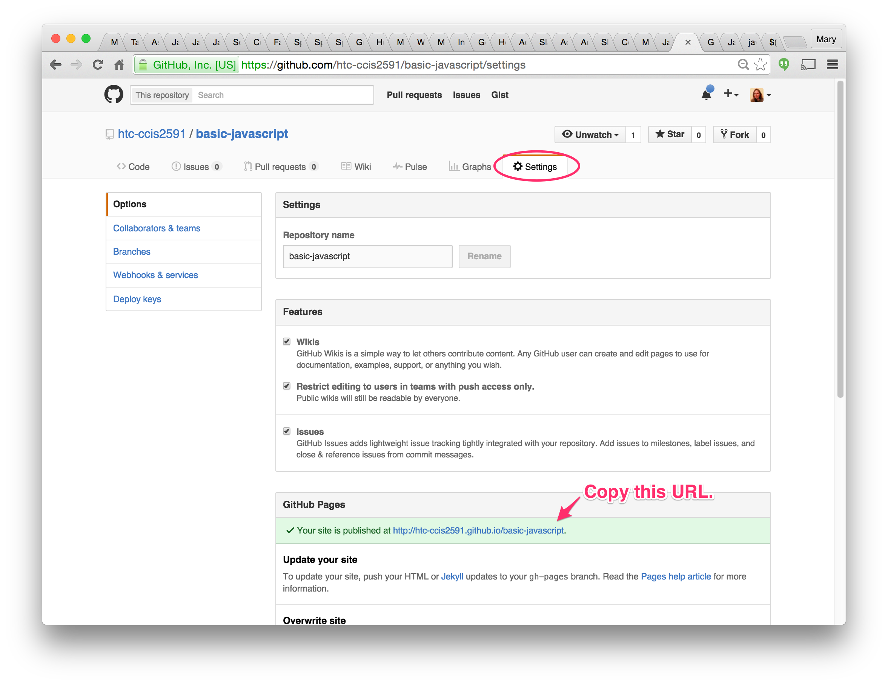
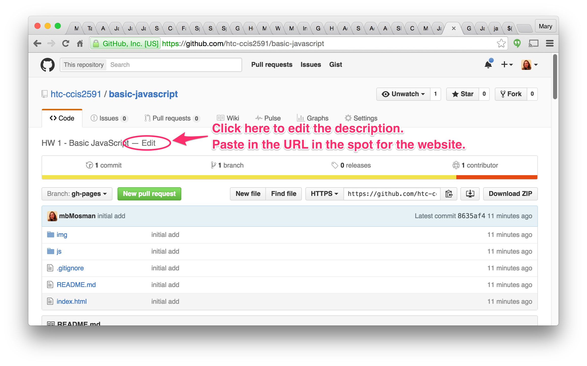
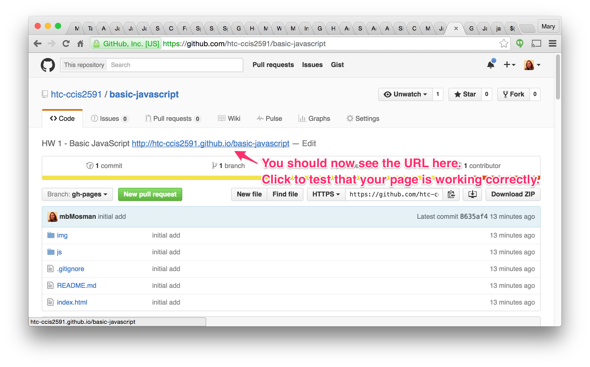

# HW1 - Basic Javascript

## Goals
- Learn to make variables in Javascript
- Use string concatenation
- Use arithmetic operators
- Make an array and use array notation to access elements of the array
- Write a basic for loop
- Use a for loop to process the elements in an array

## Reading
Before beginning this assignment, you should read through chapters 1, 2, and 4 in the textbook to learn basic Javascript syntax.  You should read Chapter 3 before coming to class, but it is not required to complete this coding assignment.

## GitHub Info
Repository:  https://github.com/htc-ccis2591/basic-javascript

You need to fork this repository and submit a pull request to turn in the assignment.  Please post a screenshot of the pull request to the D2L dropbox.  The dropbox is mainly used to communicate due dates, not for storing the completed work.  You do not need to upload the project to D2L, only to GitHub.

## Provided Files
Open the project (the basic-javascript folder) in Brackets. When using Brackets, it is important to open the entire folder, not just a single file.

Look at the index.html file provided.  Notice that it includes a javascript file near the bottom.  It is generally considered a best practice to include your JavaScript files at the end of the HTML page to improve performance.  

If you are including more than one JavaScript file, the order that you include them is also important. The browser will run them in the order that you include them. This means that if one script depends on another (perhaps a library such as jQuery) to run, the that dependent file must be included before the one that needs it.

Use the Brackets Live Preview feature to view the web page.  The output from the JavaScript will display in the console.  Open the Developer Tools and go to the JavaScript Console to see the output.

## Assignment
Open the js/script.js file.  To complete the assignment, you will need to add JavaScript code as indicated in the comments. The code provided will create functions and log messages as it calls them one at a time.

In the assignment, you are expected to write messages to the console.  You will use the console.log() function to do this.  The value you pass into the function (put between the parens) is what will be shown in the console.  That can be either a string (a message) or a value such as a number or an array.  Look at the code provided at the bottom to see some examples of how it is used.

When the assignment is complete the output should look something like this:

## Final Testing
When you are done, push your files to GitHub, then make sure that your page displays and runs correctly on the GitHub website.  
Go to your repository settings, and locate the URL where the page is published.  Copy this URL.

Go back to the repository view and edit the description. Paste in the URL in the space for the website.  

Click the link to view the page and make sure that it runs correctly.  

After you have verified the page is working, create the pull request to submit the assignment.  Take a screenshot of your Open Pull Request and put that in the assignment dropbox.
